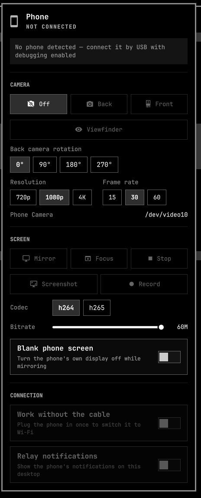

# Dori — use an Android phone as a webcam on Linux

**Turn your Android phone into a webcam and a second screen on Linux.** The
phone's camera appears as an ordinary `/dev/video*` device, so **Google Meet,
Zoom, Microsoft Teams, Discord, Slack, Jitsi, Firefox, Chrome and OBS Studio**
see it as any other USB webcam — no app to install on the phone, no account, no
video going through anyone else's server.

An Android phone is a good camera and a spare screen that you already own. Dori
puts both on the Omarchy bar: one icon, one panel, everything over the USB cable
you charge with. It runs on Wayland and Hyprland, built on `adb`, `scrcpy` and
`v4l2loopback`.



- **Live preview** — a still of the phone's screen beside the controls,
  refreshed about every two and a half seconds while the panel is open, and not
  at all when it is closed or when the full mirror is up.
- **Camera** — the phone's back or front camera appears as an ordinary webcam at
  `/dev/video10`, so Google Meet, Zoom, Microsoft Teams, Discord, Slack, Jitsi,
  OBS Studio and anything else that opens a `/dev/video*` node can use it
  without knowing where the picture comes from — and a modern phone's rear
  sensor is a far better camera than the one in a laptop lid. Rotation,
  resolution and frame rate are on the panel, and a **viewfinder** button opens
  the loopback node in a window so you can fix your framing without joining a
  call to look at yourself.
- **Screen** — the phone's display mirrored in a window, with audio and
  keyboard, at a bitrate and codec you choose.
- **Screenshot** — one click puts the phone's screen on your clipboard and in
  `~/Pictures/dori`, because the reason you took it is usually to paste it.
- **Record** — the phone's screen to an mp4 in the background, with no mirror
  window in the way, while you keep using the phone.
- **Notifications** — the phone's notifications, on this desktop. No app to
  install on the phone, no account in the middle: adb can already read them.
- **No cable** — switch the connection to Wi-Fi and unplug. Everything above
  keeps working.
- **It tells you what is wrong.** A phone that is plugged in but not authorised
  looks exactly like a working one from the bar. Dori says which it is.

Everything the panel does, the scripts in [`bin/`](bin) also do from a
terminal, so a phone that will not cooperate can be debugged without the shell
in the way.

## Requirements

| | |
|---|---|
| Omarchy | Quattro (the Quickshell bar) |
| Phone | Android 12 or newer for the camera; any adb-capable Android for the mirror |
| Packages | `scrcpy`, `android-tools`, `v4l-utils`, `v4l2loopback-dkms`, `v4l2loopback-utils` |
| Optional | `mpv` or `ffmpeg`, for the camera viewfinder |
| Optional | `wl-clipboard`, so a screenshot lands on the clipboard as well as on disk |
| On the phone | USB debugging enabled in Developer options |

`bin/dori-setup` installs the packages for you on Arch and Omarchy.

## Install

```bash
omarchy plugin add https://github.com/infiniV/omarchy-dori --enable
```

Then run the one-time host setup, in a terminal, once per machine:

```bash
~/.config/omarchy/plugins/io.github.infiniv.dori/bin/dori-setup
```

It installs the missing packages, creates Dori's own loopback node with
`v4l2loopback-ctl`, and installs a small systemd unit that recreates it after
every reboot. It asks for your sudo password when it needs it and never
installs a passwordless sudo rule. The screen mirror works without any of this;
only the webcam needs the module.

It does not write anything to `/etc/modprobe.d`, so it neither disturbs nor is
disturbed by anything else on the machine using `v4l2loopback` — OBS, Droidcam,
`omarchy-camera-effects`. If Dori 1.0.0 left a `dori-v4l2loopback.conf` behind,
running the setup again removes it.

If `/dev/video10` is already taken by another tool, pick a free number and tell
both halves about it:

```bash
bin/dori-setup --device-number 11   # then set "Webcam device" to /dev/video11
```

Finally, enable USB debugging on the phone (Settings › Developer options), plug
it in, and accept the prompt it shows. The bar icon lights up when a stream is
live.

## Use

| Where | Action |
|---|---|
| Left click the icon | open the panel |
| Right click | cycle the camera: off → back → front → off |
| Middle click | start or focus the screen mirror |
| Panel | all of it, plus screenshot, recording, notifications, codec, bitrate, and Wi-Fi |

**Notifications.** Turn on *Relay notifications* and what appears on the phone
appears here. Ongoing notifications — music players, downloads, "app is
running" — are skipped, because they re-post forever. Nothing is written down
but a hash of what has already been shown, in `$XDG_RUNTIME_DIR`; the
notification text itself is never stored.

**Working without the cable.** Plug the phone in, open the panel, and turn on
*Work without the cable*. Dori switches the phone's adb to Wi-Fi and reconnects
over the network; the cable can then come out and the camera, the mirror and
everything else keep working. Turning it back off closes the network connection
and puts the phone's daemon back on USB, so it is not left listening.

The icon stays on the bar, dimmed, when no phone is attached. Turn on **Hide the
bar icon when no phone is attached** in the plugin's settings if you would rather
it disappeared.

### Picking the phone in a video call

The phone shows up as **Phone Camera**, alongside any built-in webcam.

| App | Where |
|---|---|
| Google Meet | Settings › Video › Camera |
| Zoom | Settings › Video › Camera |
| Microsoft Teams | Settings › Devices › Camera |
| Discord | Settings › Voice & Video › Video Device |
| Slack | Settings › Audio & Video › Camera |
| Jitsi, or any site in Firefox or Chrome | the camera picker in the call, or the browser's site permissions |
| OBS Studio | add a **Video Capture Device (V4L2)** source |

Start the camera from the panel *before* opening the app — most of them scan
for devices once, at startup, and a webcam that appears later will not be in
the list until they are restarted. If the picture is upside down or sideways,
set that camera's rotation in the panel rather than fighting it in the app.

## Settings

Omarchy renders these from the manifest, under the plugin's own settings.

| Setting | Default | What it is for |
|---|---|---|
| Live preview | on | the still of the phone's screen in the panel |
| Webcam device | `/dev/video10` | must match the node `dori-setup` made; change both together with `dori-setup --device-number N` |
| Back / front camera id | `0` / `1` | run `scrcpy --list-cameras` if the two buttons are swapped |
| Back / front camera rotation | `0` / `0` | clockwise turn applied to the picture, for a sensor that arrives rotated; set `180` if it is upside down. Also on the panel, under CAMERA, where it follows the camera you have selected |
| Camera resolution | `1080p` | longest edge of the captured picture. 4K mostly heats the phone up for detail the far end scales away again |
| Camera frame rate | `30` | what video calls use; `60` is for recording something that moves |
| Typing into the mirror | `sdk` | `uhid` acts like a real keyboard: it needs a layout set on the phone first, and on some Samsungs it leaves the phone's own keyboard wedged |
| Mirror codec | `h264` | `h265` is smaller at the same quality and needs a phone that encodes it |
| Mirror bitrate | `20 Mbps` | 4 is unwatchable, 60 saturates USB 2 |
| Mirror frame rate | `60` | |
| Blank the phone screen | off | turns the phone's own display off while mirroring |

Dori asks the phone which hardware encoder it has rather than pinning a vendor
name, so h265 works on a Samsung, a Pixel, and a OnePlus without being told
which is which.

## From a terminal

```bash
bin/dori-status [--full]        # one JSON blob: device, battery, camera, mirror
bin/dori-camera back|front|off|cycle [--back-rotation 180] [--max-size 1280] [--fps 60]
bin/dori-view   start|stop|toggle    # watch the loopback node in mpv or ffplay
bin/dori-mirror start|toggle|focus|stop|restart [--codec h265] [--bitrate 30M]
bin/dori-shot                   # screenshot to ~/Pictures/dori and the clipboard
bin/dori-frame --slot a         # one low-res frame, for the panel's preview
bin/dori-notify start|stop|toggle|status|once
bin/dori-record start|stop|toggle|status
bin/dori-wireless on|off|status
bin/dori-setup [--uninstall]
```

Every script takes `--help`. Logs go to `$XDG_RUNTIME_DIR/dori/`, never to a
shared `/tmp` path.

Everything that keeps running — the camera stream, the mirror, a recording, the
notification relay, the viewfinder — is a transient systemd user unit named
`dori-camera`, `dori-mirror`, `dori-record`, `dori-notify`, or `dori-view`. So
the usual tools apply:

```bash
systemctl --user status 'dori-*'
systemctl --user stop dori-mirror
```

## When it does not work

| What you see | What it means |
|---|---|
| "Accept the USB debugging prompt" | the phone is attached but has not trusted this machine; unlock it and look for the dialog |
| "No webcam device at /dev/video10" | `v4l2loopback` is not loaded — run `bin/dori-setup` |
| "v4l2loopback is loaded but nothing created /dev/video10" | something else on the machine owns the module and loaded it without Dori's node. Run `bin/dori-setup`, which adds one through `v4l2loopback-ctl` without touching the other tool's |
| `dori-setup` says the device belongs to something else | it does — run it again with a free number, `dori-setup --device-number 11`, and set the same one in settings |
| The viewfinder button is greyed out | it reads the webcam stream, so start the back or front camera first |
| "No video player" | install `mpv` or `ffmpeg` |
| Back and front buttons are swapped | set the camera ids in settings, from `scrcpy --list-cameras` |
| The camera picture is upside down or sideways | set that camera's rotation, in the panel under CAMERA or in settings. Back and front are set separately, because phones mount the two differently |
| Camera buttons do nothing on an older phone | camera capture needs Android 12; the mirror still works |
| Mirror opens then dies | see `$XDG_RUNTIME_DIR/dori/mirror.log`, or `systemctl --user status dori-mirror` |
| "no systemd user session" | the scripts run their services as user units; from a bare ssh login, start them from the desktop session instead |
| "Work without the cable" is greyed out | it needs the phone on the cable once, to switch it over |
| Wi-Fi connects, then drops later | phones reset adb over TCP on reboot and on some Wi-Fi changes; plug in and switch again |
| Everything is slow over Wi-Fi | the phone's screen is off; wake it. Android throttles the radio while it sleeps |
| The mirror opens but lags over Wi-Fi | it is already on the lighter profile; drop the bitrate further, or plug the cable back in |
| Everything fails with "more than one device" | it should not — every script names one device, preferring the cable. Set `DORI_SERIAL` if you have two phones and want the other one |
| The phone's own on-screen keyboard stops typing | a `uhid` session can leave Samsung's keyboard wedged. `adb shell am force-stop com.samsung.android.honeyboard`, or restart the phone. Staying on `sdk` avoids it |
| Typing into the mirror does nothing | you are on `uhid`; either switch the setting back to `sdk`, or set a layout on the phone under Settings > System > Languages and input > Physical keyboard |
| A recording will not play | it was killed rather than stopped; use the panel or `dori-record stop`, which lets scrcpy finalise the file |

## What it runs on your machine

Dori is a QML panel plus a handful of bash scripts. It starts `scrcpy`, reads
`adb`, and that is the whole of it.

- `bin/dori-setup` is the only part that uses `sudo`, only when you run it
  yourself in a terminal. It installs packages with `pacman`, writes
  `/etc/systemd/system/dori-v4l2loopback.service` and the small script it runs
  at `/usr/local/lib/dori/loopback-node`, and creates the loopback node.
  Both files are root-owned: the boot-time unit deliberately does not execute
  anything out of the plugin folder, which lives in a home directory you can
  write to. `--uninstall` removes exactly those two files and deletes Dori's
  own node, leaving the module loaded for whatever else is using it.
- No sudoers rule, passwordless or otherwise, is ever installed.
- Nothing is downloaded and executed. Nothing is sent anywhere.
- `dori-wireless` is the only part that puts anything on the network: it is
  Android's own adb-over-TCP, off by default, switched on by you, and closed
  again by the same toggle.
- Dori only ever stops what it started. Each long-running piece is a systemd
  user unit with a fixed name, and stop means `systemctl --user stop` on that
  unit. Dori never finds its processes by name, command line, or pid, so a
  `scrcpy` you started yourself — even one recording, even one writing to the
  same webcam node — is invisible to it and cannot be signalled by it, and
  there is no pid to validate and race against.
- The preview frames and the notification hashes live in `$XDG_RUNTIME_DIR`:
  your user only, in memory, gone at logout. The notification text itself is
  handed to the desktop over D-Bus with the content on stdin — never on a
  command line, where any local user could read it out of /proc while it runs. Screenshots and recordings go where
  you would expect, under `~/Pictures` and `~/Videos`.

## Uninstall

```bash
~/.config/omarchy/plugins/io.github.infiniv.dori/bin/dori-setup --uninstall
omarchy plugin remove io.github.infiniv.dori
```

The first line removes the unit, its helper script, and Dori's own loopback
node; the second removes the plugin. The `v4l2loopback` module is left loaded,
because something else on the machine may be using it, and the packages are
left installed.

## Credits

Built on [scrcpy](https://github.com/Genymobile/scrcpy) by Genymobile, which does
all of the hard work, and [v4l2loopback](https://github.com/umlaeute/v4l2loopback).

## License

[MIT](LICENSE)
